# greenwood-library-website
## This project describes practicing cloning a repository and working with branches in Git

## Setting up Github repository for greenwood library website

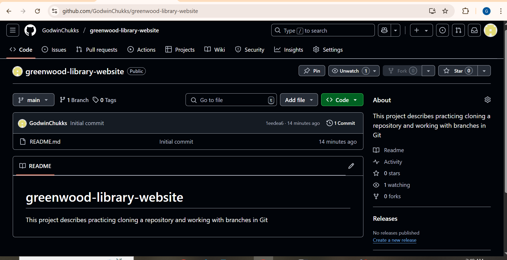

## webpages files screenshots

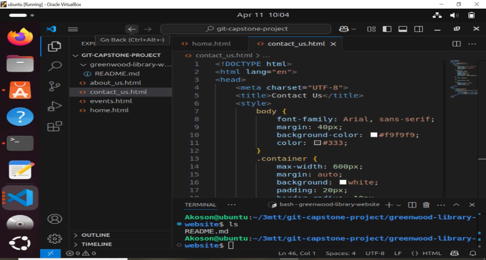

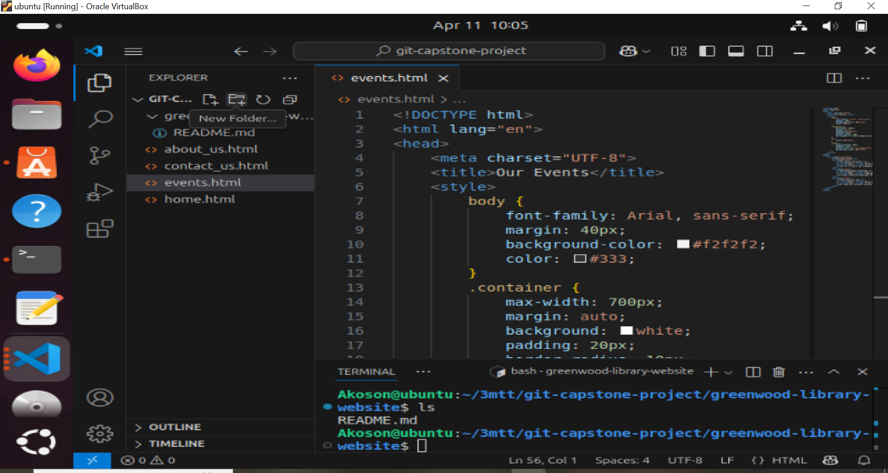

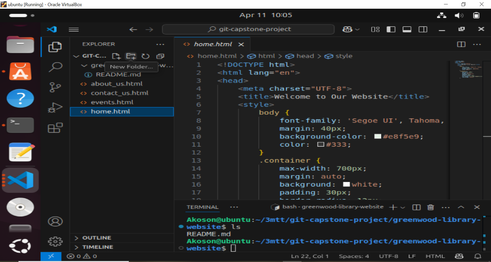

## Git main branch screenshot

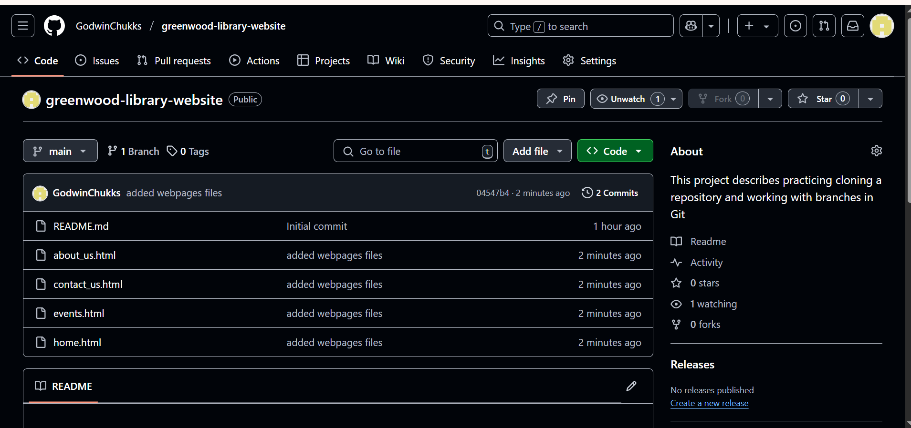

## Git command

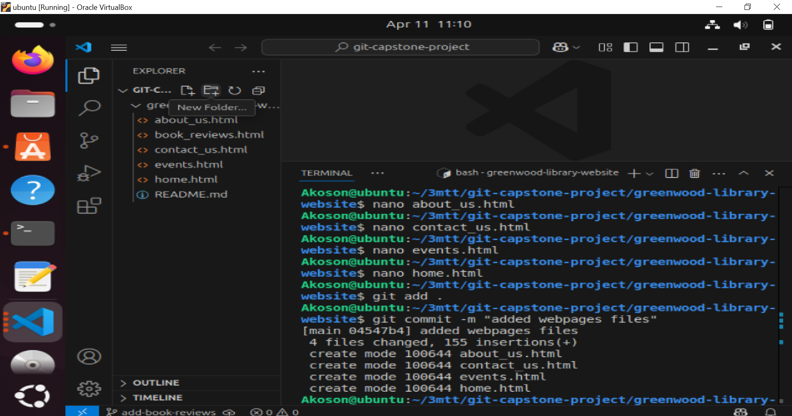

## Morgan pull request screenshots

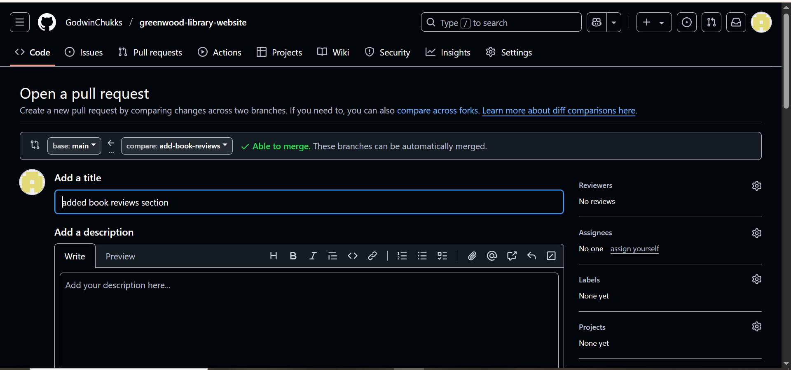

## Merging Morgan branch to main branch screenshot

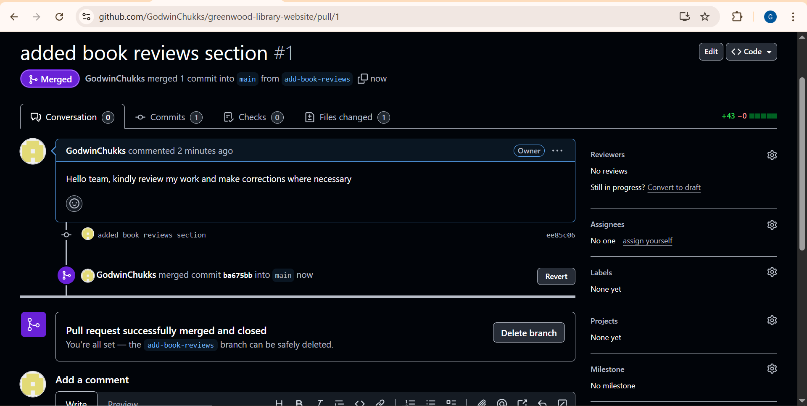

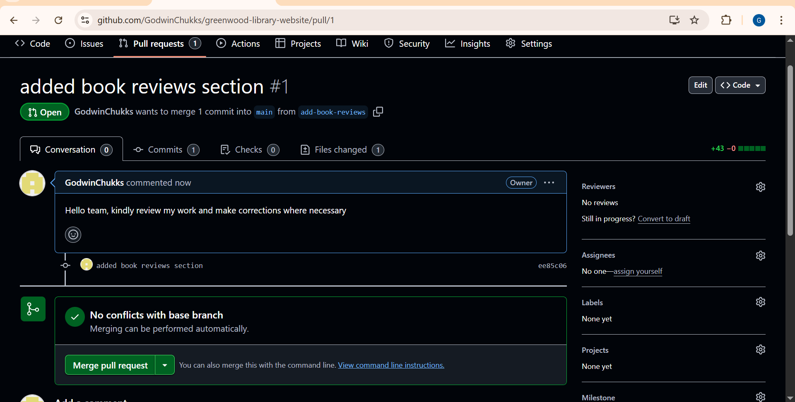

## Morgan branch workflow Github commands

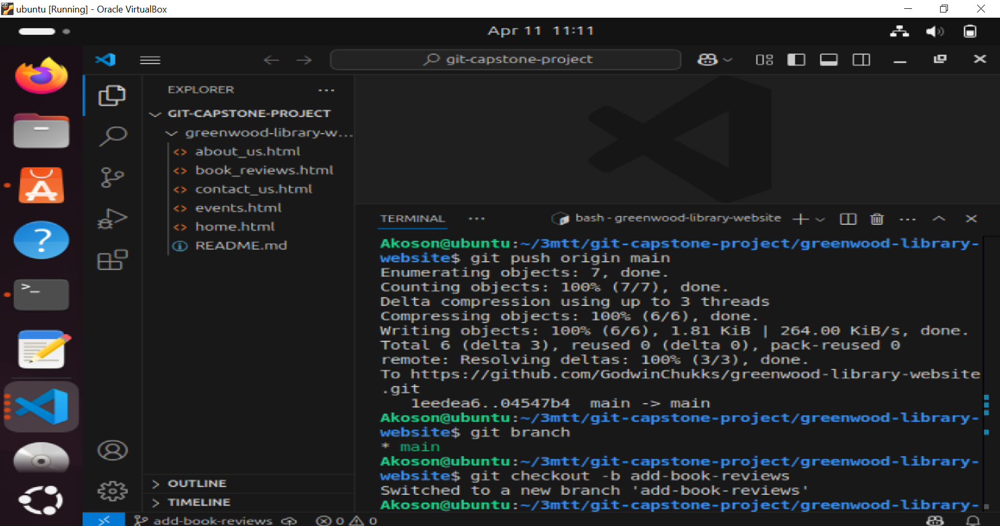

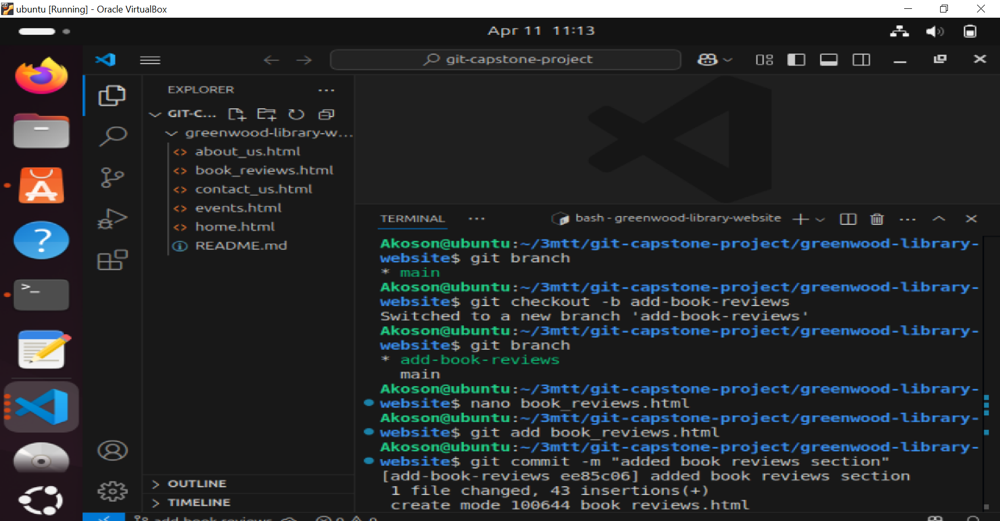

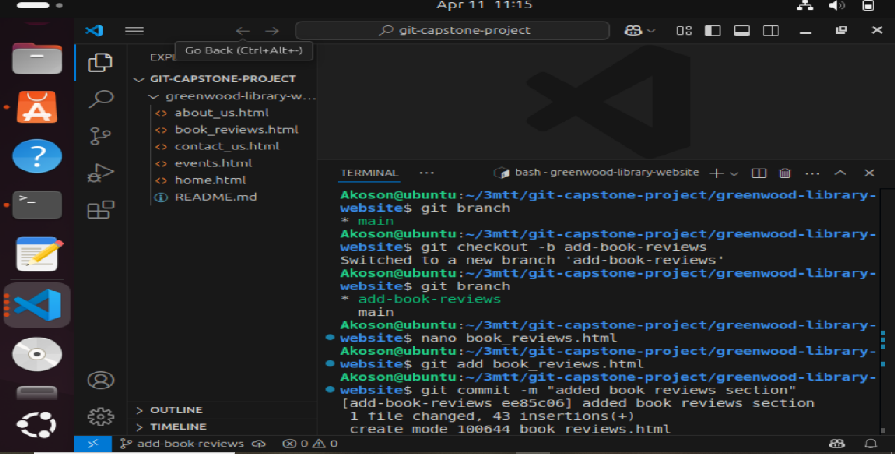

## Jamie branch workflow Github command

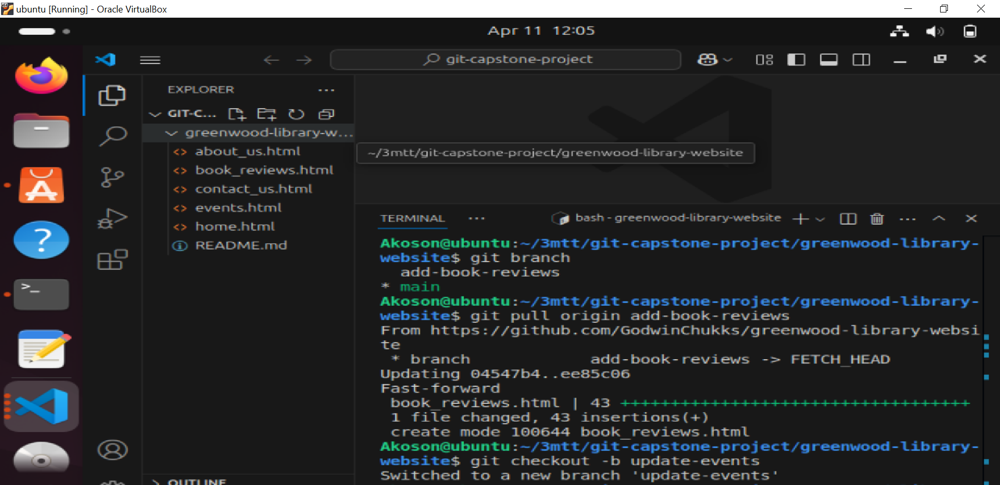

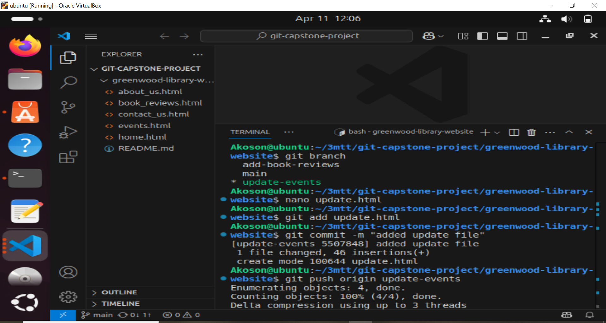

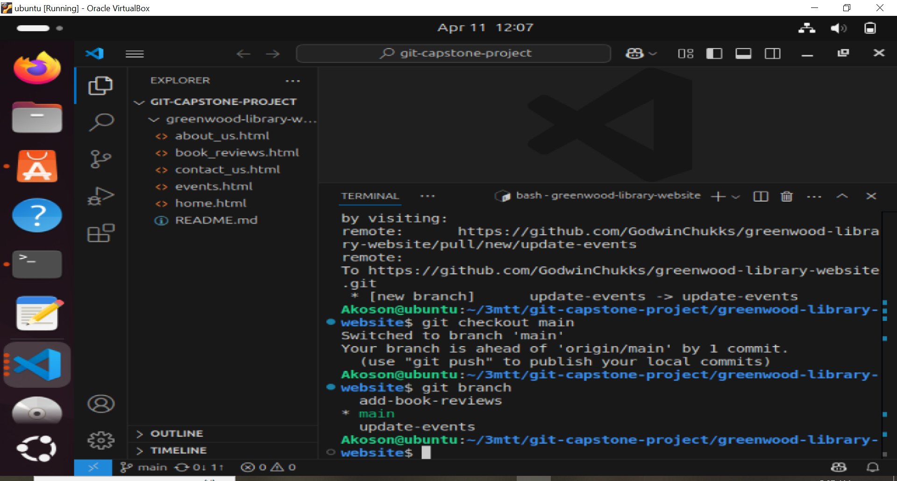

## Jamie pull request screenshoot

## Merging Jamie branch to main branch screenshot

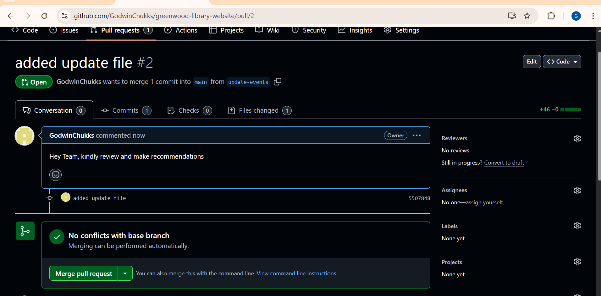

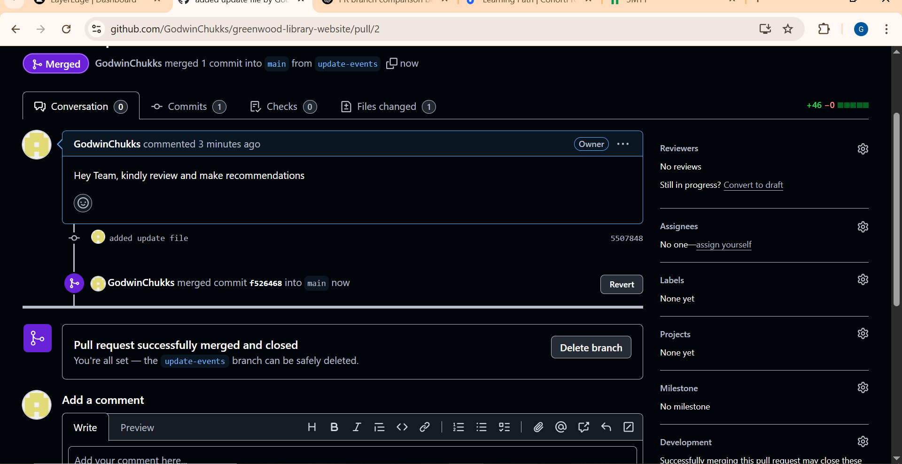

## Github dashboard screenshot

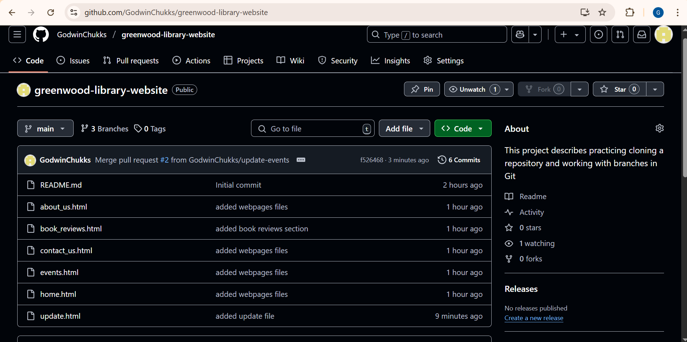
